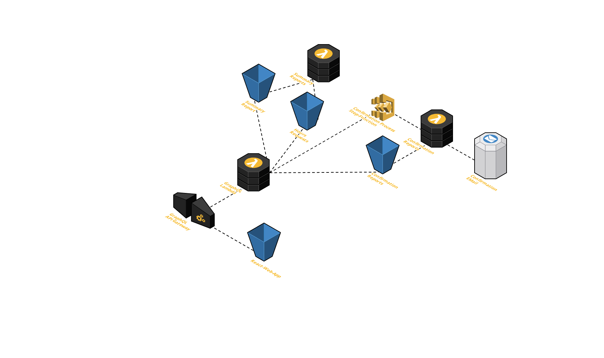

# AWS Full Serverless Example

## Architecture



## Technologies

* NodeJS
* TypeScript
* React
* Apollo-GraphQL
* Monorepo-Project with Lerna
* Programmatically Serverless-Deployment with AWS-CDK
* AWS Cloud-Service usage:
  * S3
  * API-Gateway
  * Lambda Functions
  * Step Functions

## Setup your AWS-Account

> TBD!

## Development

```bash
yarn
yarn dev
```

## Deployment

```bash
yarn bootstrap & yarn deploy
```
