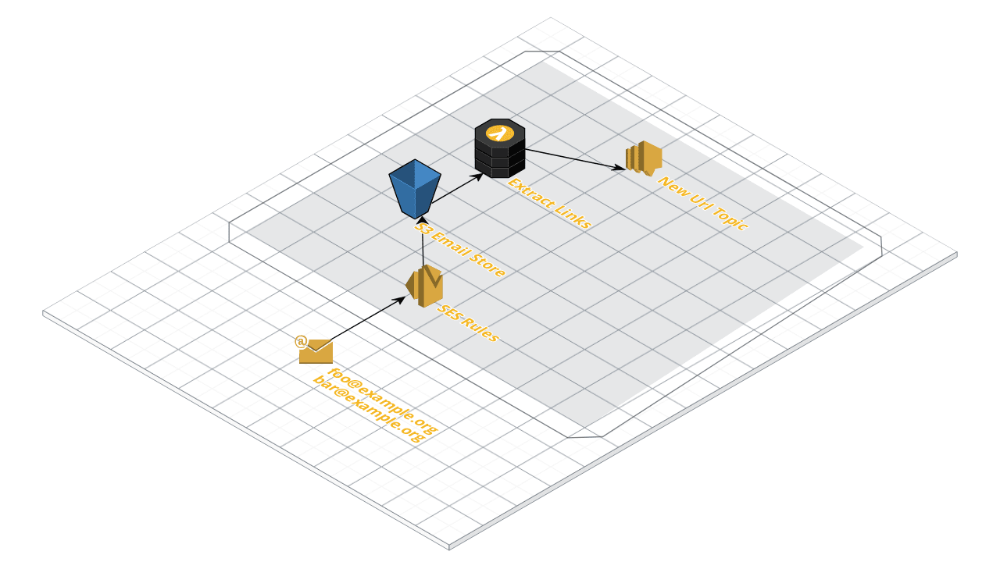

# Email Hook

Monorepo setup with lernajs and yarn workspaces (mostly taken from https://github.com/Quramy/lerna-yarn-workspaces-example)

## Architecture



## Components

- SES
- Custom Components
- Lambda
- S3
- SNS

## Setup

```bash
yarn install
npm run watch
cdk synth
```

## Pipeline

```
aws ssm put-parameter --name /CDK/GitHubToken --type String --overwrite --value GITHUB_TOKEN
```

## Useful commands

- `npm run build` compile typescript to js
- `npm run watch` watch for changes and compile
- `cdk deploy` deploy this stack to your default AWS account/region
- `cdk diff` compare deployed stack with current state
- `cdk synth` emits the synthesized CloudFormation template
