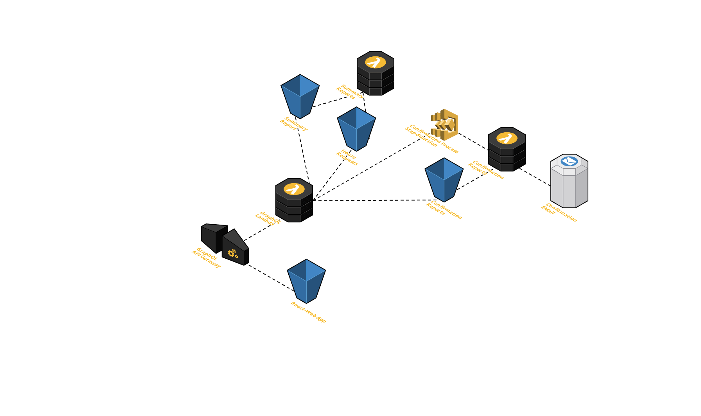

# AWS Serverless Time-Tracker App Example

## Architecture



## Technologies

* **NodeJS**
* **JavaScript/TypeScript**
* **React**
* **Apollo-GraphQL**
* Monorepo-Project with **Lerna**
* Programmatically Serverless-Deployment with **AWS-CDK**
* **AWS-SDK** Cloud-Service usage:
  * Storage and WebApp-Hosting using **S3**
  * Access via **API-Gateway**
  * Data-Processing and Web-Services using **Lambda-Function**
  * Workflow/Process-Manager via **Step-Function**
  * EMail via **SES**

## Setup your AWS-Account

> TBD!

## Development

```bash
yarn
yarn dev
```

## Deployment

```bash
yarn bootstrap & yarn deploy
```
