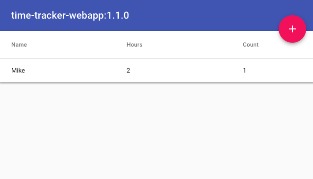
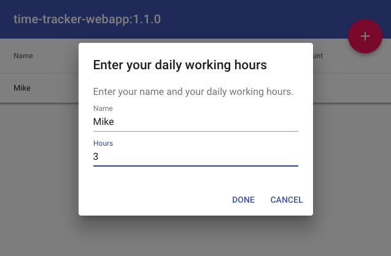

# Time-Tracker App

* React
* Apollo GraphQL

## Components

### Home

* Executes `Summary`-Query via [GraphQL-API](../time-tracker-graphql/README.md#queries)



### Hours Input

* Add working hours for a name
* Executes `RecordHours`-Mutation via [GraphQL-API](../time-tracker-graphql/README.md#mutations)
* Implements `Optimistic-UI` to handle long running  (> 3s) [summary report](../time-tracker-reports-generator/README.md) generation



## Development

```bash
yarn
yarn dev
yarn build
yarn start
```

## Production

```bash
yarn
yarn build
yarn start
```

## AWS-CDK Deploy

* S3 WebSite Deployment

```bash
yarn deploy
```